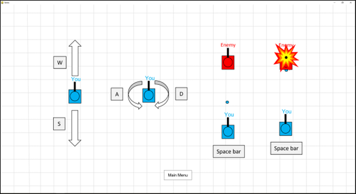
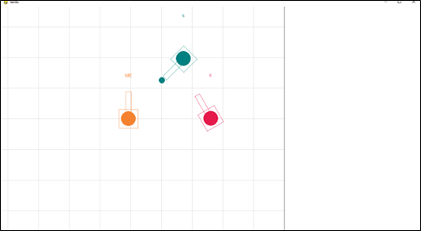

# A-level-Computer-Science-Project
A 2D LAN multiplayer tank shooter game created in Python

### Built With
Pygame is used for graphics processing and image rendering

The socket library is used for real-time communication between the host computer and client computers on a LAN to create an almost seamless multiplayer on a local network
